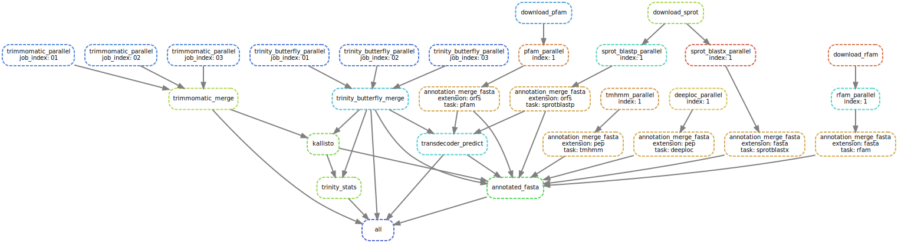

# transXpress-snakemake
transXpress: a [Snakemake](https://snakemake.readthedocs.io/en/stable/) pipeline for rapid de novo transcriptome assembly and annotation

Also see our sister project: [transXpress-nextflow](https://github.com/transXpress/transXpress-nextflow)

## Intro

## Dependencies

Requires
* snakemake 5.4.2+ (install via conda)
* fastqc (install via conda)
* trimmomatic (install via conda)
* Trinity (install via conda)
* SPAdes (install via conda)
* TransDecoder (install via conda)
* BioPython (install via conda)
* samtools (install via conda)
* bowtie2 (install via conda)
* infernal (install via conda)
* HMMER (install via conda)
* kallisto (install via conda)
* NCBI BLAST+ (install via conda)
* R (install via conda)
* edgeR (install via conda)
* seqkit (install via conda)
* wget (install via conda)
* [deeploc](http://www.cbs.dtu.dk/cgi-bin/nph-sw_request?deeploc)
* basic Linux utitilies: split, awk, cut, gzip

## Installation

1. Install [Miniconda3](https://conda.io/en/latest/miniconda.html)
2. Install snakemake and other dependencies:  
~~~~
 conda config --add channels bioconda
 conda config --add channels conda-forge
 conda config --add channels r
 conda install snakemake fastqc trimmomatic trinity spades transdecoder biopython samtools bowtie2 infernal hmmer kallisto blast r bioconductor-edger seqkit wget
~~~~
3. Install deeploc
      * Download deeploc from http://www.cbs.dtu.dk/cgi-bin/nph-sw_request?deeploc
      * Install dependencies: `pip install -r requirements.txt`
      * Install deeploc: `python setup.py install` or locally: `python setup.py install --user`

## Usage

Run locally with 10 parallel threads:
~~~~
snakemake --cores 10 --config samples_file=samples_file.txt
~~~~

Run on an LSF cluster:
~~~~
snakemake --latency-wait 60 --jobs 10000 --cluster 'bsub -n {threads} -R "rusage[mem={params.memory}000] span[hosts=1]" -oo {log}.bsub'
~~~~

## Running tests
~~~~
cd tests
./run_test.sh
~~~~

## Flow

