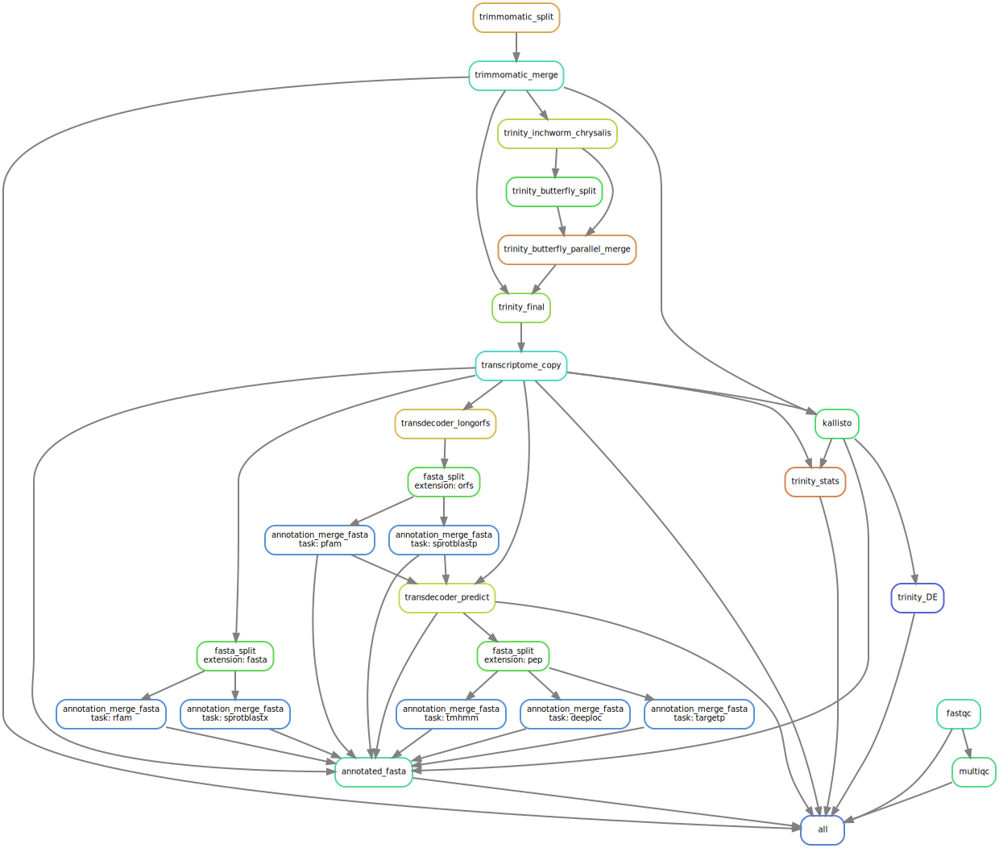

transXpress: a [Snakemake](https://snakemake.readthedocs.io/en/stable/) pipeline for streamlined de novo transcriptome assembly and annotation

## Intro

## Dependencies

transXpress requires:
* snakemake 5.4.2+ (install via conda)
* fastqc (install via conda)
* multiqc (install via conda)
* trimmomatic (install via conda)
* Trinity (install via conda)
* SPAdes (install via conda)
* TransDecoder (install via conda)
* BioPython (install via conda)
* samtools (install via conda)
* bowtie2 (install via conda)
* infernal (install via conda)
* HMMER (install via conda)
* kallisto (install via conda)
* NCBI BLAST+ (install via conda)
* R (install via conda)
* edgeR (install via conda)
* seqkit (install via conda)
* wget (install via conda)
* sra-tools (install via conda)
* tidyverse (required for Trinity, install via conda)
* python 3.6, numpy 1.16, scipy 1.0, theano 1.0.1, six 1.11 (required for deeploc, install via conda)
* [deeploc](https://services.healthtech.dtu.dk/service.php?DeepLoc-1.0)
* [targetp 2.0](http://www.cbs.dtu.dk/services/TargetP/)
* tmhmm.py (install via pip)
* basic Linux utitilies: split, awk, cut, gzip

## Installation

1. Install [Miniconda3](https://conda.io/en/latest/miniconda.html)

2. To ensure correct versions of R packages will be used unset R_LIBS_SITE
~~~~
unset R_LIBS_SITE
~~~~

3. Setup conda environment (optional):
~~~~
conda create --name transxpress
conda activate transxpress
~~~~

4. Install snakemake and other dependencies:  
~~~~
conda config --add channels bioconda
conda config --add channels conda-forge
conda config --set channel_priority false
conda install "snakemake>=5" fastqc multiqc transdecoder samtools infernal hmmer kallisto blast=2.10 seqkit wget sra-tools
conda install r bioconductor-edger r-tidyverse
conda install "trinity>=2.11" trimmomatic bowtie2 "python>=3.6" biopython numpy=1.16 scipy=1.0 theano=1.0.1 six==1.11 parallel spades
~~~~
5. Install deeploc:
      * Download deeploc from https://services.healthtech.dtu.dk/service.php?DeepLoc-1.0 (go to Downloads)
      * Unpack and install deeploc:
        ~~~~
         tar zxvf deeploc-1.0.All.tar.gz
         cd deeploc-1.0
         pip install git+https://github.com/Lasagne/Lasagne.git (other requirements for deeploc like Numpy, Scipy, Theano==1.01 are already installed via conda)
         # install deeploc itself
         python setup.py install
        ~~~~
        (make sure the conda python is used, or use the full path to python from your conda installation)
6. Install targetp 2.0:
      * Download TargetP 2.0 from https://services.healthtech.dtu.dk/software.php
      * extract the tarball and add path to targetp /bin/ folder to the PATH variable
        ~~~~
         tar zxvf targetp-2.0.Linux.tar.gz
         export PATH=$PATH:`pwd`/targetp-2.0/bin
        ~~~~
7. Install [tmhmm.py](https://github.com/dansondergaard/tmhmm.py) via pip:
~~~~
pip install tmhmm.py
~~~~

8. Check that the dependencies are installed
~~~~
for p in snakemake fastqc multiqc transdecoder samtools infernal hmmer kallisto \
    blast seqkit wget sra-tools bioconductor-edger r-tidyverse trinity trimmomatic \
    bowtie2 biopython numpy scipy theano six parallel spades ; do echo "package $p";
    conda list | grep "$p"; done
~~~~

9. Checkout the transXpress code into the folder in which you will be performing your assembly:
~~~~
git clone https://github.com/transXpress/transXpress-snakemake.git .
~~~~
or get ./transXpress folder created automatically
~~~~
git clone https://github.com/transXpress/transXpress-snakemake.git
~~~~
and symbolically link its files and folders with folder in which you will be performing your assembly:
~~~~
mkdir assembly-dir
ln -s path/to/your/transXpress/* path/to/your/assembly-dir
~~~~

## Input

Create a tab-separated file called *samples.txt* with the following contents:
~~~
cond_A    cond_A_rep1    A_rep1_left.fq    A_rep1_right.fq
cond_A    cond_A_rep2    A_rep2_left.fq    A_rep2_right.fq
cond_B    cond_B_rep1    B_rep1_left.fq    B_rep1_right.fq
cond_B    cond_B_rep2    B_rep2_left.fq    B_rep2_right.fq
~~~

Also take a look at the configuration file *config.yaml* and update as required.

You can download reads from SRA with provided script:
~~~~
./sra_download.sh <SRR0000000> <SRR0000001> <...>
~~~~
where SRR0000000 is an SRA readset ID. E.g., SRR3883773
## Running transXpress

Use the provided script:
~~~~
./transXpress.sh
~~~~

Or run snakemake manually with 10 local threads:
~~~~
snakemake --cores 10 --config samples_file=samples_file.txt
~~~~

Or run snakemake manually on an LSF cluster:
~~~~
snakemake --latency-wait 60 --jobs 10000 --cluster 'bsub -n {threads} -R "rusage[mem={params.memory}000] span[hosts=1]" -oo {log}.bsub'
~~~~

## Running tests
~~~~
cd tests
./run_test.sh
~~~~

## Flow

## Possible problems when executing on cluster systems

### Time limit
Depending on the setup of your cluster you may have to add time option in the transXpress.sh script.
If default time (depends on your cluster setup) for submitted job is not sufficient the job may be cancelled due to time limit.

If this is the case, add time option in submission command in transXpress.sh script.

For example, in case of Slurm change
~~~~
snakemake --latency-wait 60 --restart-times 1 --jobs 10000 --cluster "sbatch -o {log}.slurm.out -e {log}.slurm.err -n {threads} --mem {params.memory}GB" "$@"
~~~~
to
~~~~
snakemake --latency-wait 60 --restart-times 1 --jobs 10000 --cluster "sbatch -o {log}.slurm.out -e {log}.slurm.err -n {threads} --mem {params.memory} --time=06:00:00" "$@"
~~~~
This sets time limit to 6 hours. You may have to use different time limit based on size of reads used for assembly. 

See https://github.com/trinityrnaseq/trinityrnaseq/wiki/Trinity-Computing-Requirements

### Pipeline hangs when cluster cancels the job
It is possible that cluster cancels the job, but pipeline seems to be still running. This can happen because the pipeline does not receive information whether cluster job completed successfully, failed or is still running. You can add `--cluster-status` option and add script which detects the job status. 

See https://snakemake.readthedocs.io/en/stable/tutorial/additional_features.html#using-cluster-status

Alternatively, you can use snakemake [profiles](https://github.com/Snakemake-Profiles/doc) which also contain status checking script. 

See https://snakemake.readthedocs.io/en/v5.1.4/executable.html#profiles 

